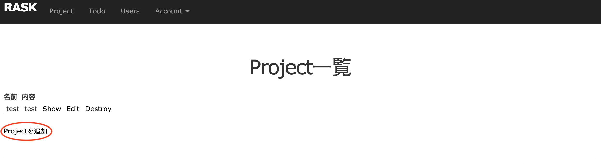
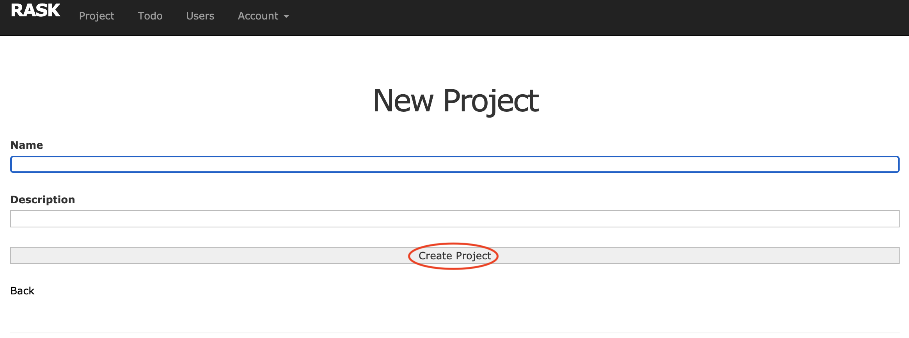
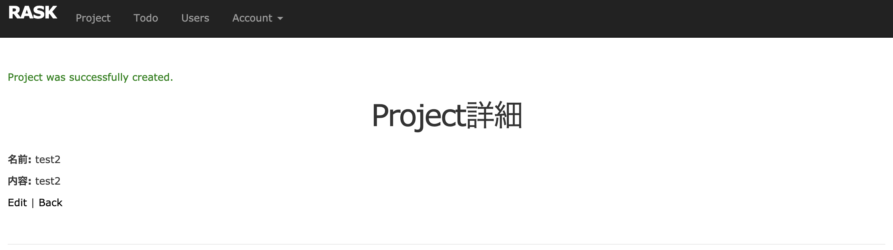
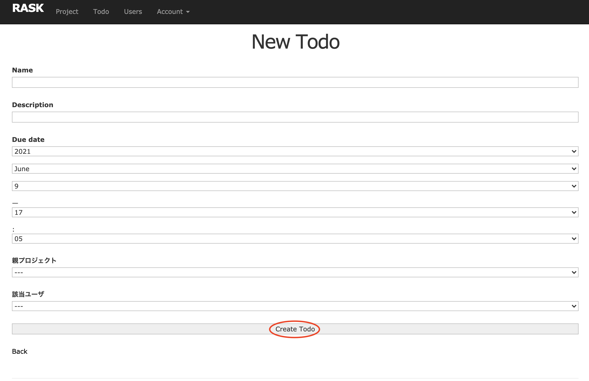
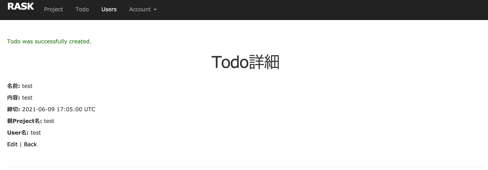

## 登録方法

### projectの登録方法

「project」をクリックする．

「project を追加する」をクリックする．

情報を入力し，「Create Project」をクリックする．

作成に成功すると以下の画面が表示される．

### TODO の登録方法

「todo」をクリックする．

「Todoを追加する」をクリックする．

情報を入力し，「Create Todo」をクリックする．

作成に成功すると以下の画面が表示される．

