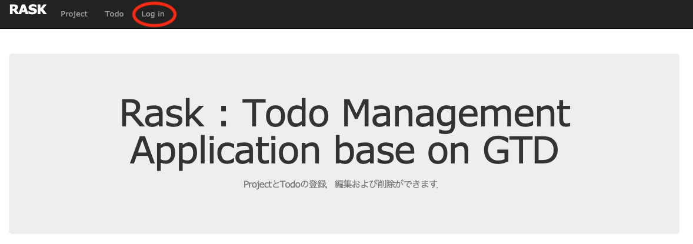
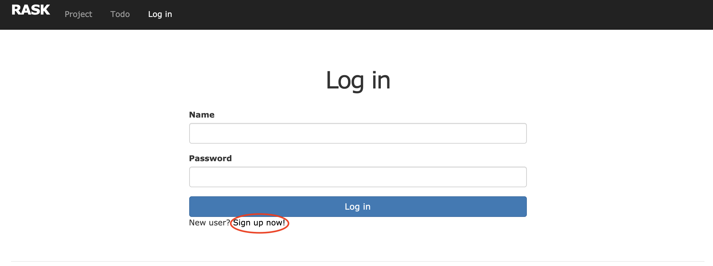
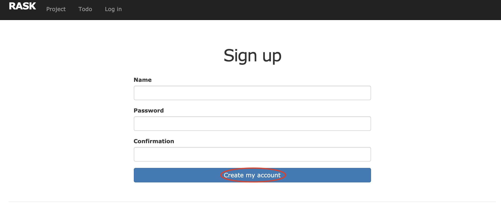
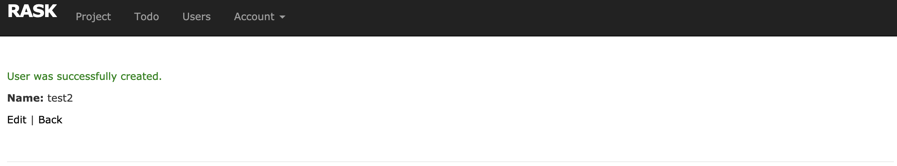
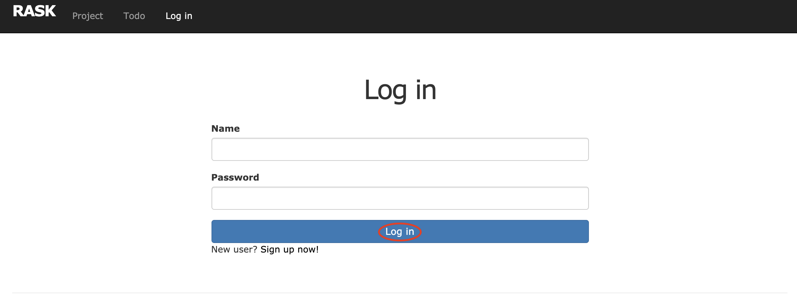

## ログイン方法

### アカウント作成

「Log in」をクリックする．

「Sign up now!」をクリックする．

ユーザ名とパスワードを入力し，「Create my account」をクリックする．

作成に成功すると以下の画面が表示される．

### ログイン方法

「Log in」をクリックする．

ユーザ名とパスワードを入力し，「Log in」をクリックする．

